<div align="center">




<br>

<a href="https://github.com/TahlilAlRaiyan">
  
</a>
<a href="https://www.instagram.com/_the_swordfish_/">
  
</a>
<a href="https://www.facebook.com/OGtheswordfish.20/">
  
</a>
<a href="mailto:raiyans525@gmail.com">
  
</a>
<br>
<a href="https://tahlilalraiyan.wixsite.com/tahlilalraiyan">
  
</a>
<br>
<a href="https://codeforces.com/profile/_the_swordfish_">
  
</a>

</div>

---

## 👨‍💻 About Me

```text
🎓 CSE Student
💻 Interested in Software Development, Data Science and Machine Learning
🧩 Enjoy building academic & personal projects
🚀 Currently improving my programming fundamentals
🌱 Learning new technologies by building real projects
🤝 Open to learning, collaboration and new ideas
```

---

## 🛠️ Tech Stack

### 💻 Programming Languages

<p align="center">
  
</p>

### 🔧 Tools & Technologies

<p align="center">
  
</p>

---

## 🚀 Featured Projects

### 🏦 Bank GUI Loan System

**Java | Swing | OOP**

A Java Swing based GUI application for managing bank loans, repayments and loan-related operations.

🔗 **Repository:**
https://github.com/TahlilAlRaiyan/Bank-GUI-Loan-System

---

### 🚗 Smart Car Rental Management System

**C# | Windows Forms | SQL Server**

Customer-role module of a Smart Car Rental Management System.

Features include:

- 🔐 Customer Login & Registration
- 🚘 View Cars with Images
- 🔎 Search Cars with Filters
- 📅 Car Booking
- ❌ Cancel Booking
- 📋 My Bookings
- 💳 Payment
- 📜 Rental History
- 👤 Customer Profile
- 🚪 Logout

🔗 **Repository:**
https://github.com/TahlilAlRaiyan/Smart-Car-Rental-Management-System-Customer-Role

---

### ⏰ Tkinter Clock App

**Python | Tkinter**

A desktop clock app combining Digital Clock, Stopwatch, Alarm, Timer and World Clock in one single-window interface, switching views through a sidebar instead of separate pop-up windows.

Features include:

- 🕒 Digital Clock
- ⏱️ Stopwatch
- ⏰ Alarm with completion sound
- ⏳ Timer with completion sound
- 🌍 World Clock with searchable locations

🔗 **Repository:**
https://github.com/TahlilAlRaiyan/tkinter-clock-app-python

---

### 🔳 QR Code Generator

**Python | qrcode | Pillow**

A lightweight Python application that converts user-provided URLs into QR code images.

Features:

- 🔗 Generate QR codes from URLs
- 🖥️ Simple command-line interface
- 🖼️ Automatically saves QR code as PNG
- 🐍 Beginner-friendly Python project

🔗 **Repository:**
https://github.com/TahlilAlRaiyan/qr-code-generator-python

---

## 📊 GitHub Statistics

<div align="center">




</div>

---

## 🔥 GitHub Streak

<div align="center">


</div>

---

## 📈 Contribution Graph

<div align="center">

<picture>
  <source media="(prefers-color-scheme: dark)" srcset="https://raw.githubusercontent.com/TahlilAlRaiyan/TahlilAlRaiyan/output/github-snake-dark.svg" />
  <source media="(prefers-color-scheme: light)" srcset="https://raw.githubusercontent.com/TahlilAlRaiyan/TahlilAlRaiyan/output/github-snake.svg" />
  
</picture>

</div>

---

## 📌 Featured Repositories

<div align="center">

<a href="https://github.com/TahlilAlRaiyan/Bank-GUI-Loan-System">
  
</a>

<a href="https://github.com/TahlilAlRaiyan/Smart-Car-Rental-Management-System-Customer-Role">
  
</a>

</div>

<div align="center">

<a href="https://github.com/TahlilAlRaiyan/qr-code-generator-python">
  
</a>

</div>

<div align="center">

<a href="https://github.com/TahlilAlRaiyan/tkinter-clock-app-python">
  
</a>

</div>

---

## 🌱 Currently Learning

```text
C++                      ███████████████░░░
C# / .NET                █████████████░░░░░
Java                     ████████████░░░░░░
Python                   ██████████░░░░░░░░
SQL                      ██████████░░░░░░░░
Artificial Intelligence  ████████░░░░░░░░░░
Machine Learning         ████████░░░░░░░░░░
```

---

## 🎯 Goals

- 📚 Strengthen my Computer Science fundamentals
- 🧠 Improve problem-solving skills
- 💻 Build more real-world projects
- 🔐 Explore software & cybersecurity
- 🚀 Continue learning and experimenting

---

## 📫 Connect With Me

<div align="center">

<a href="https://github.com/TahlilAlRaiyan">

</a>
<a href="https://www.instagram.com/_the_swordfish_/">

</a>
<a href="https://www.facebook.com/OGtheswordfish.20/">

</a>
<a href="mailto:raiyans525@gmail.com">

</a>
<br>
<a href="https://tahlilalraiyan.wixsite.com/tahlilalraiyan">

</a>
<br>
<a href="https://codeforces.com/profile/_the_swordfish_">

</a>

</div>

---

<div align="center">

### 💙 Thanks for visiting my profile!


<br><br>

*"Code. Break. Learn. Repeat."*

</div>
